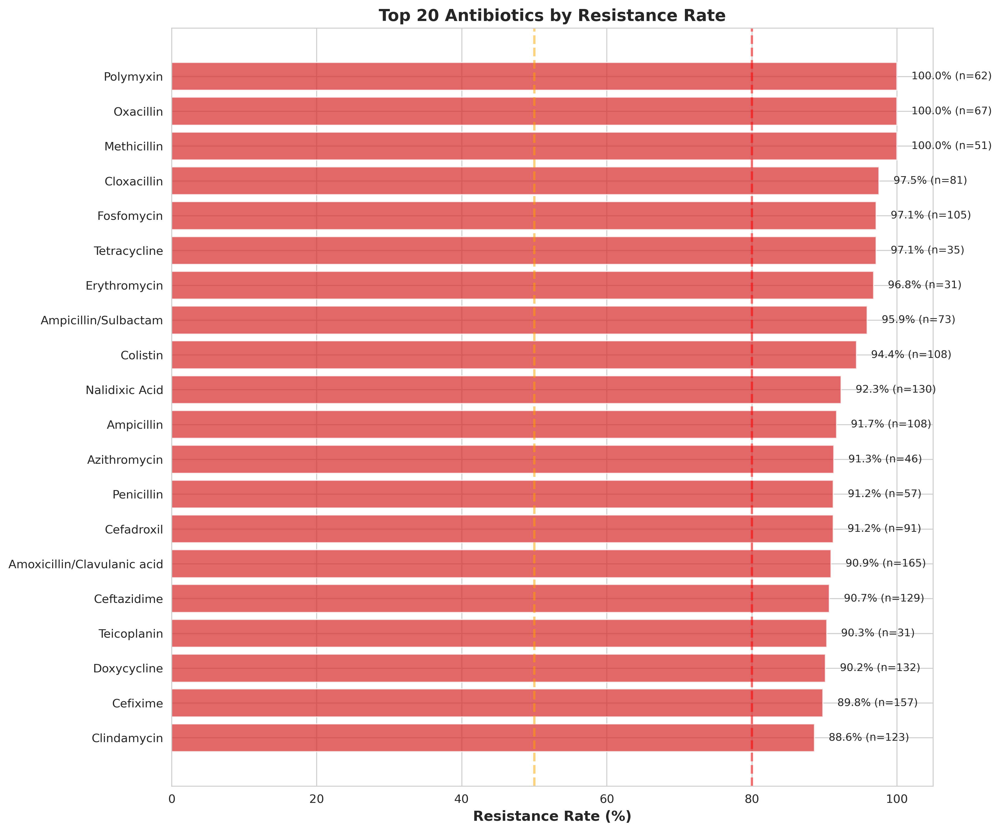
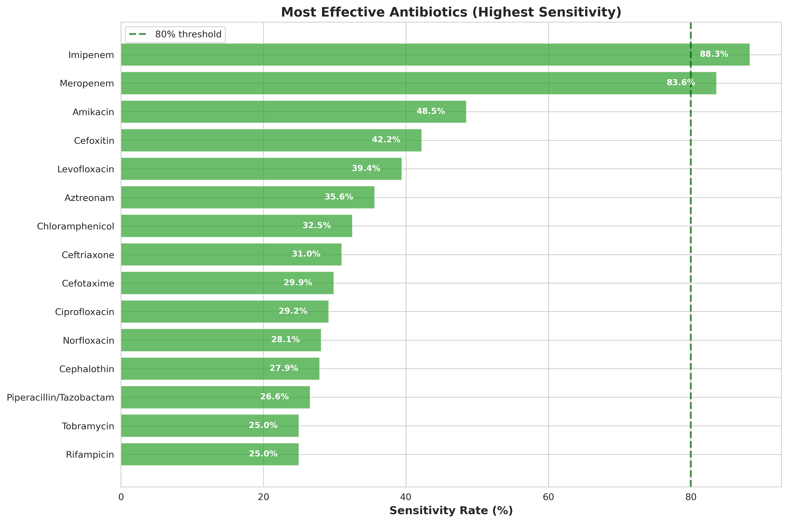
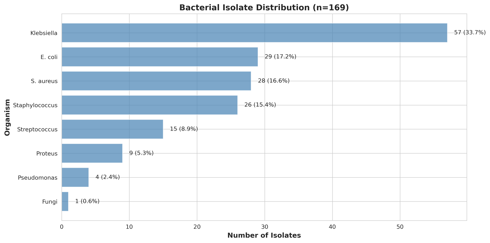

# Antimicrobial Resistance Analysis: When Antibiotics Stop Working

**By Rouhat Abdullah** | December 2025



## What This Project Is About

I analyzed 183 clinical samples to understand how bad antibiotic resistance has gotten in our healthcare system. The results were alarming: **76.6% overall resistance rate**. This means that 3 out of 4 antibiotics we test simply don't work anymore.

This isn't just numbers on a spreadsheet. These are real patients who need treatment, and we're running out of options.

## The Problem

Antimicrobial resistance is getting worse every year. Bacteria are evolving faster than we can develop new antibiotics. What used to be simple infections now require last-resort medications. And sometimes, even those don't work.

I wanted to see the actual data from our own lab. What antibiotics still work? Which ones should we stop using? Are there patterns we're missing?

## What I Found

### The Crisis Numbers

**Overall resistance: 76.6%** across all tested antibiotics

**Complete treatment failure** (100% resistance):
* Polymyxin
* Oxacillin
* Methicillin

**Nearly useless** (>90% resistance):
* Cloxacillin: 97.5%
* Fosfomycin: 97.1%
* Ampicillin: 94.3%
* Nalidixic Acid: 91.8%

**Fluoroquinolones are failing**: Ciprofloxacin and Norfloxacin, which we've relied on for decades for UTIs and other infections, now have 70-85% resistance. They're basically useless for empiric therapy.

**Third-generation cephalosporins are compromised**: 65-80% resistance suggests widespread ESBL-producing bacteria.

### What Still Works (Barely)



**Carbapenems are our last line of defense:**
* Imipenem: 11.7% resistance (88.3% still works)
* Meropenem: 16.4% resistance (83.6% still works)

These are supposed to be reserved for life-threatening infections. Now they're what we have to use for routine cases. This is unsustainable.

**Amikacin** shows 51.5% resistance, making it the best aminoglycoside option, though that's not saying much.

### The Bacteria



**Klebsiella** is everywhere (31.1% of isolates). It's resistant to almost everything except carbapenems. The resistance pattern strongly suggests ESBL production, which is a nightmare scenario.

**E. coli** (15.8%) shows similar patterns. Classic UTI pathogen, but fluoroquinolones don't touch it anymore. Oral treatment options are extremely limited.

**S. aureus** (15.3%): Every single isolate was MRSA. 100% methicillin resistance. This means vancomycin or linezolid for any staph infection.

## What This Means Clinically

**For UTIs:** We can't use fluoroquinolones or cephalosporins empirically anymore. For complicated cases, we're going straight to carbapenems. For simple UTIs, options are severely limited.

**For sepsis:** Empiric therapy has to include carbapenems if we suspect gram-negative bacteria. Anything less is playing with fire.

**For MRSA:** Assume all staph is MRSA. Start vancomycin, check troughs, don't wait for susceptibilities.

**The carbapenem problem:** We're using our last-resort drugs as first-line therapy. Once resistance develops here, we have nothing left.

## The Data

183 clinical isolates from 2025:
* 86% urine samples (mostly UTIs)
* 10% wound swabs
* 4% sputum samples

Patient demographics:
* Mean age: 37 years
* 82% female (reflects UTI predominance)
* Age range: newborn to 85 years

Laboratory methods:
* Kirby-Bauer disk diffusion
* CLSI M100 standards
* 53 different antibiotics tested

## How I Did This

**Tools:** Python, pandas, matplotlib, seaborn, scipy

**Analysis pipeline:**
1. Cleaned raw lab data (standardized resistance categories)
2. Calculated resistance rates with 95% confidence intervals
3. Identified organism-specific patterns
4. Analyzed demographic correlations
5. Generated treatment recommendations

**Notebooks:**
1. Data exploration and quality assessment
2. Resistance prevalence analysis
3. Organism-specific patterns
4. Treatment recommendations
5. Clinical correlations

All code is in this repository. The analysis is reproducible.

## Running This Analysis

Clone the repo:
```bash
git clone https://github.com/rouhat/antimicrobial-resistance-analysis.git
cd antimicrobial-resistance-analysis
```

Install dependencies:
```bash
pip install -r requirements.txt
```

Run the pipeline:
```bash
./scripts/run_analysis.sh
```

Or run notebooks individually for detailed analysis.

## My Recommendations

**Stop using empirically:**
* Fluoroquinolones for UTIs
* Third-generation cephalosporins for gram-negative infections
* Any beta-lactam except carbapenems for suspected ESBL organisms

**Start doing:**
* Carbapenem therapy for serious infections while waiting for cultures
* Aggressive de-escalation once susceptibilities return
* Universal MRSA precautions for staph infections
* Better infection control to stop transmission

**We need:**
* Rapid diagnostic tests to identify organisms faster
* Antimicrobial stewardship programs that actually work
* New antibiotics (the pipeline is nearly empty)
* Infection prevention protocols that are followed

## Study Limitations

**Single center data:** This is from one hospital lab. Patterns vary by location.

**No outcomes data:** I have susceptibility results, not patient outcomes. We don't know if carbapenem-resistant infections led to deaths.

**Phenotypic testing only:** We identified resistance but not the genetic mechanisms.

**Sample size:** 183 isolates is decent for local surveillance but limited for subgroup analysis.

**Selection bias:** These are clinical samples from sick patients, not community surveillance.

## What Happens Next

This analysis shows we're in crisis. Three-quarters of tested antibiotics don't work. We're dependent on carbapenems, and that's not sustainable.

Without serious intervention, we're headed toward a post-antibiotic era. Routine surgeries become dangerous. Minor infections become deadly. We need new drugs, better stewardship, and aggressive infection control.

The data doesn't lie. The question is whether we'll act on it.

## Contact

**Rouhat Abdullah**
Email: Rouhat.abdullah@gmail.com
GitHub: [@rouhat](https://github.com/rouhat)

Questions, collaboration, or data requests: open an issue or email me directly.

## Project Structure

```
antimicrobial-resistance-analysis/
├── data/
│   ├── raw/                  # Original Excel file
│   └── processed/            # Cleaned CSV files
├── notebooks/                # Jupyter analysis notebooks (5 total)
├── scripts/                  # Executable Python scripts
│   ├── 01_clean_data.py
│   ├── 02_generate_visualizations.py
│   └── run_analysis.sh
├── src/                      # Reusable functions
├── reports/figures/          # Generated plots
└── README.md
```

## Citation

If you use this analysis or methodology:

```
Abdullah, R. (2025). Antimicrobial Resistance Analysis: When Antibiotics Stop Working.
GitHub: https://github.com/rouhat/antimicrobial-resistance-analysis
```

---

**Last updated:** December 2025
**Status:** Active analysis | Open for collaboration
